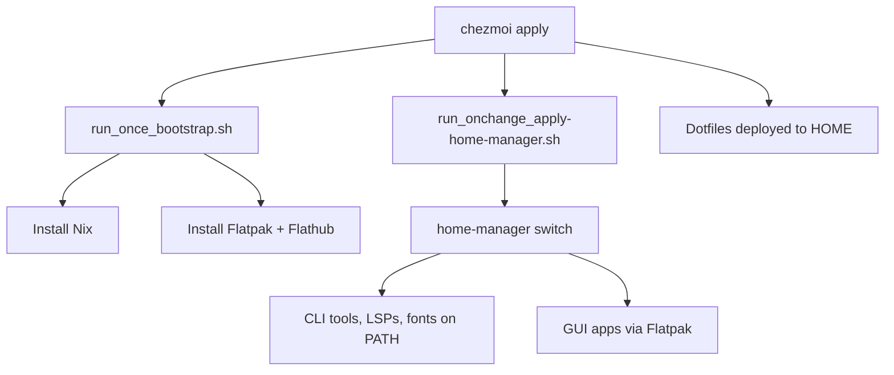

# Nix, Home Manager, and Per-Project Flakes

Personal reference for how this setup works.
If you are reading this and you are not me: congratulations, you have found
the world's least interesting diary.

## Architecture overview



**chezmoi** manages file templates and triggers scripts.
**Home Manager** (via Nix) manages packages declaratively.
**Flatpak** handles GUI applications.
The window manager and system services remain on apt (too tightly coupled
to systemd to move).

## File layout

```
~/.config/home-manager/
├── flake.nix           # Inputs: nixpkgs, home-manager, nix-flatpak
├── flake.lock          # Pinned dependency versions (committed to chezmoi repo)
├── hosts/
│   ├── abakus.nix      # Host-specific: username, WM, git identity
│   └── chuebel.nix
└── modules/
    ├── default.nix     # Module entry point (imports all subdirectories)
    ├── options.nix     # Custom options (host.wm, host.workspace, etc.)
    ├── base.nix        # Global settings: stateVersion, sessionPath
    ├── packages.nix    # CLI tools, LSP servers, formatters, fonts
    ├── flatpak.nix     # Declarative Flatpak GUI apps
    ├── shell/          # bash, readline, starship
    ├── terminal/       # kitty (config only, pkg on apt), tmux
    ├── git/            # git, lazygit
    ├── tools/          # bat, fzf, yazi, zoxide
    └── desktop/        # dunst, rofi, wofi, picom, i3, hyprland
```

Desktop modules under `desktop/` use `lib.mkIf` to conditionally install
packages based on `host.wm` (set per host).
The i3 and hyprland modules only activate on their respective hosts.

## Common tasks

### Add a package

1. Find it: `nix search nixpkgs <name>`
2. Add it to the appropriate module in the chezmoi source
   (`~/.local/share/chezmoi/dot_config/home-manager/modules/`).
   CLI tools go in `packages.nix`; WM-specific tools go in
   `desktop/i3.nix` or `desktop/hyprland.nix`.
3. Apply: `chezmoi apply` (triggers Home Manager rebuild)

### Remove a package

Delete it from the relevant module, then `chezmoi apply`.
Run `nix-collect-garbage -d` afterwards to reclaim disk space.

### Update all pinned versions

Always work in the **chezmoi source directory** (not `~/.config/home-manager/`
— that's the deployed target managed by chezmoi):

```bash
cd ~/.local/share/chezmoi/dot_config/home-manager
nix flake update
home-manager switch --flake .
git add flake.lock
git commit -m "chore: update flake.lock"
```

Then `chezmoi apply` will deploy the updated lock on other machines.

### Update a single input

```bash
cd ~/.local/share/chezmoi/dot_config/home-manager
nix flake lock --update-input nixpkgs
home-manager switch --flake .
```

## Per-project flakes with direnv

This is the killer feature. Each project gets its own `flake.nix` that
declares exactly what it needs, pinned via its own `flake.lock`.
direnv activates the environment automatically when you `cd` into the project.

### Create a new project environment

```bash
mkdir ~/projects/my-thing && cd ~/projects/my-thing
git init
```

Create `flake.nix`:

```nix
{
  description = "my-thing dev environment";

  inputs = {
    nixpkgs.url = "github:NixOS/nixpkgs/nixpkgs-unstable";
  };

  outputs = { nixpkgs, ... }:
    let
      system = "x86_64-linux";
      pkgs = nixpkgs.legacyPackages.${system};
    in
    {
      devShells.${system}.default = pkgs.mkShell {
        packages = with pkgs; [
          python3
          uv
          ruff
        ];

        shellHook = ''
          echo "my-thing dev shell active"
        '';
      };
    };
}
```

Create `.envrc`:

```bash
use flake
```

Then:

```bash
direnv allow
```

From now on, every time you `cd` into the project, the pinned dependencies
are loaded automatically. The first load takes a moment (Nix evaluates the
flake); subsequent loads are cached by nix-direnv.

### Update project dependencies

```bash
cd ~/projects/my-thing
nix flake update
direnv reload
```

Commit the `flake.lock` to the project repo.

### Useful patterns

**Python project with virtualenv:**

```nix
devShells.${system}.default = pkgs.mkShell {
  packages = with pkgs; [ python3 uv ruff ];
  shellHook = ''
    if [ ! -d .venv ]; then
      uv venv
    fi
    source .venv/bin/activate
  '';
};
```

**Node project:**

```nix
devShells.${system}.default = pkgs.mkShell {
  packages = with pkgs; [ nodejs_22 corepack ];
};
```

**C/C++ project:**

```nix
devShells.${system}.default = pkgs.mkShell {
  packages = with pkgs; [ gcc clang-tools cmake gnumake ];
};
```

## Neovim without Mason

Previously, Mason (a Neovim plugin) downloaded and managed LSP servers and
formatters. This is now handled by Nix instead.

### How it works

1. LSP servers (`lua-language-server`, `ruff`, `clangd`, `taplo`, etc.) are
   installed as Nix packages in `packages.nix`
2. They end up on `$PATH` via the Nix profile
3. `nvim-lspconfig` finds them on `$PATH` by default — no Mason required
4. Formatters (`stylua`, `prettier`, `shfmt`, `clang-format`) are likewise on
   `$PATH` and found by none-ls automatically

### Per-project LSP servers

If a project needs a specific LSP version that differs from your global one,
put it in the project's `flake.nix`:

```nix
devShells.${system}.default = pkgs.mkShell {
  packages = with pkgs; [
    python3
    ruff          # project-specific version
    nodePackages.pyright  # different type checker for this project
  ];
};
```

When direnv activates, the project's versions shadow the global ones.
Neovim picks up whichever is first on `$PATH` — which is the project's.

### ty (Astral type checker)

`ty` is available in nixpkgs (unstable channel) and included in
`packages.nix` alongside `ruff`.

## Flatpak

GUI apps are declared in `flatpak.nix`. Home Manager applies them via
`nix-flatpak`.

### Add a GUI app

1. Find the Flatpak ID: `flatpak search <name>` or browse
   [Flathub](https://flathub.org/)
2. Add the ID string to `flatpak.nix`
3. `chezmoi apply`

### Remove a GUI app

Delete from `flatpak.nix`, then `chezmoi apply`.
Optionally `flatpak uninstall --unused` to clean up runtimes.

### Run a Flatpak app

Flatpak apps appear in your desktop launcher. From CLI:

```bash
flatpak run com.google.Chrome
```

## Garbage collection

Nix keeps old generations. To free disk space:

```bash
# Remove all old generations and unreferenced store paths
nix-collect-garbage -d

# Remove generations older than 30 days (less aggressive)
nix-collect-garbage --delete-older-than 30d

# Check store size
du -sh /nix/store
```

## Troubleshooting

### `nix` command not found after install

Source the daemon script:

```bash
. /nix/var/nix/profiles/default/etc/profile.d/nix-daemon.sh
```

Or restart your shell. Home Manager's `programs.bash` sources it in
`bashrcExtra`.

### Home Manager switch fails with "collision"

Two packages provide the same binary. Use `home.packages` priorities or
remove one. Check with:

```bash
nix-env -q | sort
```

### GPU-accelerated apps fail (OpenGL/EGL errors)

Apps that use the GPU (kitty, alacritty, any OpenGL/Vulkan program) **cannot
be installed via Nix on non-NixOS**.
The Nix binaries look for OpenGL/EGL libraries in the Nix store, but the
actual GPU drivers (Nvidia, Mesa) are system-level and only accessible from
system paths.

Symptom:

```
Failed to create GLFWwindow. This usually happens because of old/broken
OpenGL drivers. kitty requires working OpenGL 3.1 drivers.
```

**Approaches we tried and rejected:**

- **nixGL** (`nix-community/nixGL`): the standard wrapper for this problem.
  Broken with current nixpkgs-unstable — the Nvidia driver override uses a
  `kernel` argument that the refactored `nvidia_x11` derivation no longer
  accepts.
  Also requires `--impure` for auto-detection, or per-host driver version
  pinning (fragile across driver updates).
- **Manual `LD_LIBRARY_PATH` wrapper**: pointing to `/usr/lib/x86_64-linux-gnu`
  causes glibc version conflicts (system libc vs Nix libc).
  Narrowing to `/usr/lib/x86_64-linux-gnu/nvidia` avoids glibc but still
  fails to provide a working EGL context.

**Rule:** keep GPU-accelerated GUI apps on apt. This includes:

- Terminal emulators (kitty, alacritty, wezterm)
- Games (Steam)
- Anything using OpenGL, Vulkan, or EGL

CLI tools, LSP servers, formatters, and non-GPU apps are fine via Nix.

### Flatpak apps look ugly (wrong theme)

Install the GTK theme as a Flatpak runtime:

```bash
flatpak install flathub org.gtk.Gtk3theme.Adwaita-dark
```

Or set the override:

```bash
flatpak override --user --env=GTK_THEME=Adwaita:dark
```

### Flatpak: proprietary apps fail with `apply_extra`

Apps like **Google Chrome** and **VS Code** use `extra-data` — they download
proprietary binaries at install time via an `apply_extra` script. This script
requires network namespace access (`loopback`), which fails inside
nix-flatpak's sandboxed systemd service:

```
bwrap: loopback: Failed RTM_NEWADDR: Operation not permitted
Error: Failed to install com.google.Chrome: While trying to apply extra data: apply_extra script failed
```

**Workaround:** install these apps manually or via `.deb`:

```bash
# Manual Flatpak install (works outside the sandbox)
flatpak install com.google.Chrome
flatpak install com.visualstudio.code

# Or use the .deb / apt repo as before
```

Do NOT add these to `flatpak.nix` — they will fail every `chezmoi apply`.

### direnv is slow on first cd

Normal. nix-direnv caches aggressively after the first evaluation.
Subsequent loads should be instant. If it stays slow, check that
`programs.direnv.nix-direnv.enable = true` is set in the shell module.

### Package not found in nixpkgs

Search the unstable channel:

```bash
nix search nixpkgs#<name>
```

Or browse [search.nixos.org](https://search.nixos.org/packages).

> [!NOTE]
> The `nodePackages.*` namespace has been removed in recent nixpkgs-unstable.
> Most packages (e.g. `prettier`, `typescript-language-server`) are now
> top-level. If you see "nodePackages has been removed", just use the package
> name directly.

### First `chezmoi apply` fails after Nix install

The Nix installer requires a shell restart before `nix` is on PATH.
If you see "ERROR: Nix not found", either:

```bash
# Source Nix into your current shell
. /nix/var/nix/profiles/default/etc/profile.d/nix-daemon.sh

# Then re-run
chezmoi apply
```

Or simply `exec bash` and try again.

### Stale references in `~/.profile`

Old installers (e.g. `uv`, `cargo`) may have added lines to `~/.profile`
that reference files no longer present. If you see errors like
`/home/user/.local/bin/env: No such file or directory`, edit `~/.profile`
and remove the offending line. Chezmoi does not manage `~/.profile`.

## Shell configuration ownership

On Linux, Home Manager owns `.bashrc` via `programs.bash`. All shell
integrations (direnv, fzf, starship, zoxide) use
`enableBashIntegration = true`, so their `eval` hooks are injected
automatically. PATH entries are declared in `home.sessionPath`, and
session variables in `home.sessionVariables`.

Chezmoi manages `.bashrc` only on Windows, where Home Manager is not
available. The starship config is also split: HM owns it on Linux via
`programs.starship.settings`; chezmoi provides a static
`starship.toml` for Windows.
