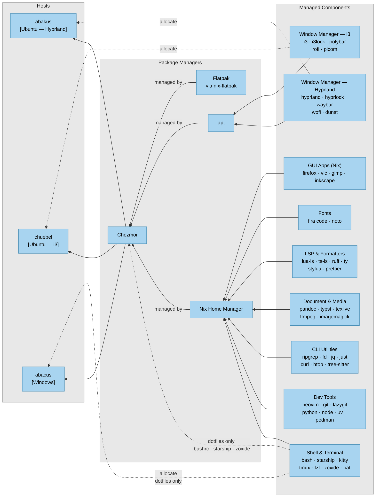

# Home environment overview

Architecture of the chezmoi-managed home environment across three hosts, including dotfiles, packages, tooling, and desktop configuration.

## Legend

| Notation | Meaning |
|---|---|
| solid arrow | Dependency / composition |
| dotted arrow | Partial or platform-specific allocation |
| "managed by" | Chezmoi orchestrates this package manager |
