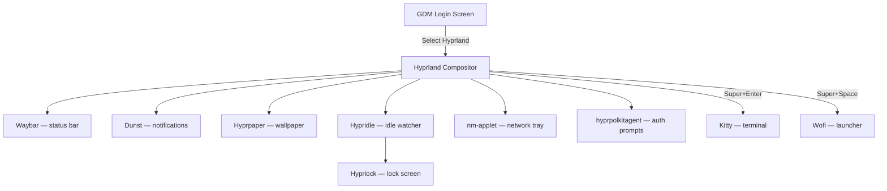

# Understanding Hyprland — Full Configuration

A practical introduction covering what Hyprland is, how this modular Lua
configuration works, and how each component fits together.

## What is Hyprland?

Hyprland is a **tiling Wayland compositor**.
Three words, three concepts.

### Wayland

Wayland replaces X11 (Xorg) as the display protocol on Linux.
X11 dates from 1987 and carries decades of accumulated design debt.
Wayland is simpler, more secure, and better suited to modern GPUs.

Some older applications assume X11.
Hyprland includes **XWayland** compatibility so most of those still work.

### Compositor

On Wayland, the compositor is the programme that manages windows, handles
input, talks to the GPU, and draws everything on screen.
It replaces both the X server and the window manager in one shot.

### Tiling

A tiling window manager arranges windows automatically so they fill the
screen without overlapping.
New windows split the available space; you navigate with keybindings
rather than dragging rectangles around with a mouse.

This sounds restrictive until you try it.
After a week you'll wonder what you were doing before.

## Core Concepts

### Windows

Windows are either **tiled** (arranged automatically) or **floating**
(positioned freely).
Toggle floating with `Super+V`.

### Workspaces

Virtual desktops, numbered 1–10.
Switch with `Super+1` through `Super+0`.
Move windows between them with `Super+Shift+1` through `Super+Shift+0`.

There is also a **scratchpad** (special workspace): a hidden workspace
you can toggle with `Super+backtick`.
Useful for a persistent terminal or notes window.

### The Modifier Key

Almost every keybinding starts with `Super` (the Windows logo key, or
`Command` on Apple keyboards).

### Layouts

This configuration uses **dwindle**: each new window splits the current
space in half, alternating horizontally and vertically.

```
┌───────────┬───────────┐
│           │           │
│     1     │     2     │
│           │           │
│           ├─────┬─────┤
│           │  3  │  4  │
└───────────┴─────┴─────┘
```

Toggle the split direction with `Super+S`.

## How the Full Configuration Works

### Modular Lua

This branch uses Hyprland's **Lua configuration** (requires Hyprland
0.55+).
Instead of one large file, the config is split into modules:

```
~/.config/hypr/
├── hyprland.lua            # Entry point — loads all modules
├── configs/
│   ├── programs.lua        # Terminal, launcher definitions
│   ├── environment-variables.lua
│   ├── monitors.lua        # Display detection
│   ├── input.lua           # Keyboard, mouse, touchpad, gestures
│   ├── appearance.lua      # Borders, gaps, decorations, animations
│   ├── autostart.lua       # Programmes launched at session start
│   ├── window-rules.lua    # Per-window behaviour overrides
│   └── keybindings.lua     # All keybindings
├── hyprlock.conf           # Lock screen (hyprlang, not Lua)
├── hypridle.conf           # Idle timers (hyprlang, not Lua)
└── hyprpaper.conf          # Wallpaper (hyprlang, not Lua)
```

`hyprland.lua` is the entry point.
It calls `require()` for each module, which Lua loads from the `configs/`
directory.

### Why Lua Instead of Hyprlang?

Hyprlang (Hyprland's native config language) is simple key-value pairs.
It works well for small configs but becomes unwieldy for larger setups.

Lua brings:
- **Variables** — define a programme path once, use it everywhere
- **Loops** — bind 10 workspaces in 4 lines instead of 20
- **Modules** — separate concerns into files
- **Logic** — conditionals, functions, dynamic behaviour

The trade-off: Lua config requires Hyprland 0.55+.
If your build is older, use the `feat/hyprland-minimal` branch instead
(plain hyprlang).

### Module Walkthrough

#### `programs.lua`

Defines programme paths as a Lua table:

```lua
local programs = {
    terminal = "kitty",
    menu     = "wofi --show drun",
}
return programs
```

Other modules import this with `require("configs.programs")` so there is
one place to change your terminal or launcher.

#### `environment-variables.lua`

Sets environment variables so desktop applications know they are running
on Wayland under Hyprland:

```lua
hl.env("XDG_CURRENT_DESKTOP", "Hyprland")
hl.env("XDG_SESSION_TYPE", "wayland")
hl.env("ELECTRON_OZONE_PLATFORM_HINT", "wayland")
```

The Electron hint tells Electron apps (VS Code, Discord, etc.) to use
native Wayland instead of falling back to XWayland.

#### `monitors.lua`

Auto-detects all connected displays.
No hardcoded resolution or position — adjust once you know your actual
monitor names (use `hyprctl monitors` to find them).

#### `input.lua`

Keyboard layout, mouse sensitivity, touchpad behaviour, and gestures.
Three-finger horizontal swipe switches workspaces.

#### `appearance.lua`

Visual configuration using the **Catppuccin Mocha** palette:

- **Borders** — lavender active, overlay grey inactive
- **Gaps** — 3px inner, 5px outer
- **Rounding** — 8px corner radius
- **Shadow** — subtle, base-colour
- **Blur** — enabled, moderate
- **Animations** — custom bezier curves for smooth transitions

The full Catppuccin Mocha palette is documented at the top of the file
for reference.

#### `autostart.lua`

Programmes launched once when the session starts:

| Programme | Purpose |
|-----------|---------|
| `hyprpolkitagent` | Polkit authentication (GUI privilege prompts) |
| `waybar` | Status bar |
| `dunst` | Notification daemon |
| `hyprpaper` | Wallpaper |
| `hypridle` | Idle timer (dim, lock, dpms) |
| `nm-applet` | Network manager tray applet |

These run in the background.
If any of them are not installed, Hyprland will log a warning but
continue running.

#### `window-rules.lua`

Rules that override default window behaviour:

- **Suppress maximize** — prevents apps from maximising themselves
- **XWayland drag fix** — works around a known XWayland issue
- **Float settings apps** — nm-applet, pavucontrol, blueman float
  instead of tiling

#### `keybindings.lua`

All keybindings in one place.
Uses the programme table from `programs.lua` so changing your terminal
only requires editing one file.

Workspace bindings use a loop:

```lua
for i = 1, 10 do
    local key = tostring(i % 10)
    hl.bind(mainMod .. " + " .. key, hl.dsp.focus({ workspace = i }))
end
```

This is more maintainable than 20 separate lines.

## The Companion Stack

Hyprland is deliberately **not** a full desktop environment.
It tiles windows and handles input.
Everything else is a separate programme.

### Waybar — Status Bar

```
~/.config/waybar/
├── config.jsonc         # Bar layout and module selection
├── style.css            # Visual styling
├── colors-waybar.css    # Catppuccin Mocha colour variables
└── modules/             # One file per module
    ├── hyprland-workspaces.jsonc
    ├── clock.jsonc
    ├── cpu-usage.jsonc
    ├── memory-usage.jsonc
    ├── network.jsonc
    ├── pulseaudio.jsonc
    ├── battery.jsonc
    └── tray.jsonc
```

The main config (`config.jsonc`) includes module files and defines which
modules appear on the left, centre, and right of the bar.

The colour file (`colors-waybar.css`) defines CSS variables using the
Catppuccin Mocha palette, so the style file references `@text`,
`@surface0`, `@lavender`, etc. instead of raw hex codes.

### Dunst — Notifications

```
~/.config/dunst/dunstrc
```

Handles desktop notifications (the pop-ups that appear when something
wants your attention).
Styled with Catppuccin Mocha colours and FiraCode Nerd Font.

Urgency levels have different frame colours:
- **Low** — grey (`#6c7086`)
- **Normal** — lavender (`#b4befe`)
- **Critical** — red (`#f38ba8`)

### Wofi — Application Launcher

```
~/.config/wofi/
├── config      # Behaviour settings
└── style.css   # Visual styling
```

A Wayland-native application launcher.
Press `Super+Space`, type the name of an application, press Enter.

### Hyprlock — Lock Screen

```
~/.config/hypr/hyprlock.conf
```

Takes a blurred screenshot of the current desktop as the background and
displays a password input field with the current time and date.

Lock manually with `Super+Escape`.
Hypridle locks automatically after 5 minutes of inactivity.

### Hypridle — Idle Daemon

```
~/.config/hypr/hypridle.conf
```

Watches for inactivity and triggers actions:

| Timeout | Action |
|---------|--------|
| 3 minutes | Dim screen to 10% |
| 5 minutes | Lock screen |
| 6 minutes | Turn off display (DPMS) |

No suspend is configured.
Activity resumes the display and restores brightness.

> [!TIP]
> If the idle timers annoy you during initial testing, comment out the
> `hl.exec_cmd("hypridle")` line in `configs/autostart.lua`.

### Hyprpaper — Wallpaper

```
~/.config/hypr/hyprpaper.conf
```

Currently a **placeholder** with no wallpaper configured.
To add one:

```hyprlang
preload = ~/Pictures/wallpaper.jpg
wallpaper = ,~/Pictures/wallpaper.jpg
```

## How It All Fits Together



Hyprland is the conductor.
It starts the companion programmes via `autostart.lua` and then manages
windows, input, and rendering.

## Quick Reference

### Keybindings

| Action | Bind |
|--------|------|
| Open terminal | `Super+Enter` |
| Open launcher | `Super+Space` |
| Close window | `Super+Q` |
| Focus left/down/up/right | `Super+H/J/K/L` |
| Move window | `Super+Shift+H/J/K/L` |
| Switch workspace | `Super+1..0` |
| Move window to workspace | `Super+Shift+1..0` |
| Toggle floating | `Super+V` |
| Fullscreen | `Super+F` |
| Pseudo-tile | `Super+P` |
| Toggle split direction | `Super+S` |
| Scratchpad toggle | `Super+backtick` |
| Lock screen | `Super+Escape` |
| Exit Hyprland | `Super+Shift+E` |

Arrow keys work as alternatives to `H/J/K/L`.

Mouse: `Super+Left-drag` moves, `Super+Right-drag` resizes,
`Super+Scroll` switches workspaces.

Media keys work for volume, brightness, and playback if the hardware
supports them.

### The HJKL Pattern

```
     K
     ↑
 H ←   → L
     ↓
     J
```

Consistent for focus and window movement.

### Useful Commands

```bash
# List connected monitors
hyprctl monitors

# List all windows
hyprctl clients

# List active keybindings
hyprctl binds

# Reload the configuration
hyprctl reload

# Get the Hyprland version
hyprctl version

# Check the session log
cat ~/.local/share/hyprland/hyprland.log
```

## Customising After the First Boot

### Change keyboard layout

Edit `configs/input.lua`:

```lua
kb_layout = "us,de"
kb_options = "grp:win_space_toggle"
```

### Add monitor rules

Run `hyprctl monitors` to find monitor names, then edit
`configs/monitors.lua`:

```lua
hl.monitor({
    output = "eDP-1",
    mode = "1920x1080@60",
    position = "0x0",
    scale = "1"
})
```

### Add a wallpaper

Place an image somewhere (e.g. `~/Pictures/wallpaper.jpg`), then edit
`hyprpaper.conf`:

```hyprlang
preload = ~/Pictures/wallpaper.jpg
wallpaper = ,~/Pictures/wallpaper.jpg
```

### Change the terminal

Edit `configs/programs.lua`:

```lua
terminal = "alacritty",
```

All keybindings reference this table, so only one change is needed.

### Add application autostart

Edit `configs/autostart.lua`:

```lua
hl.exec_cmd("[workspace 1 silent] kitty")
hl.exec_cmd("[workspace 2 silent] firefox")
```

The `[workspace N silent]` prefix starts the app on a specific workspace
without switching to it.

## Troubleshooting

### Nothing happens when I press Super+Enter

- Is `kitty` installed? Run `which kitty`.
- Is the config in the right place? Check `~/.config/hypr/hyprland.lua`.
- Check `~/.local/share/hyprland/hyprland.log` for Lua errors.

### Waybar does not appear

- Is `waybar` installed?
- Run `waybar` manually to see errors.
- Check `journalctl --user -u waybar`.

### Lock screen does not work

- Is `hyprlock` installed? It must be built from source on Ubuntu 24.04.
- Run `hyprlock` manually to see errors.
- Ensure `hypridle` is running: `pgrep hypridle`.

### Idle timers are annoying during testing

Comment out the hypridle line in `configs/autostart.lua`:

```lua
-- hl.exec_cmd("hypridle")
```

Reload with `hyprctl reload`.

### The screen is blank after login

- GDM has known issues with Hyprland.
  Try `Ctrl+Alt+F3`, log in, run `Hyprland`.
- Check `~/.local/share/hyprland/hyprland.log`.

### I want to go back to my normal desktop

Log out (`Super+Shift+E`), choose your previous session from GDM.

## Differences from the Minimal Branch

| Feature | Minimal | Full |
|---------|---------|------|
| Config format | hyprlang (single file) | Lua (modular) |
| Lock screen | No | Yes (hyprlock) |
| Idle daemon | No | Yes (hypridle) |
| Wallpaper | No | Placeholder (hyprpaper) |
| Media keys | No | Yes |
| Scratchpad | No | Yes |
| Window rules | No | Yes |
| Animations | Defaults | Custom beziers |
| Waybar modules | 5 | 7 (+ colour variables) |
| Gestures | No | 3-finger swipe |

## Further Reading

- [Hyprland Wiki](https://wiki.hypr.land/) — the definitive reference
- [Master Tutorial](https://wiki.hypr.land/Getting-Started/Master-Tutorial/)
  — official getting-started guide
- [Configuring Variables](https://wiki.hypr.land/Configuring/Variables/)
  — all configuration options
- [Lua Configuration](https://wiki.hypr.land/Configuring/Start/)
  — Lua-specific config documentation
- [Catppuccin for Hyprland](https://github.com/catppuccin/hyprland)
  — the theme palette used here
