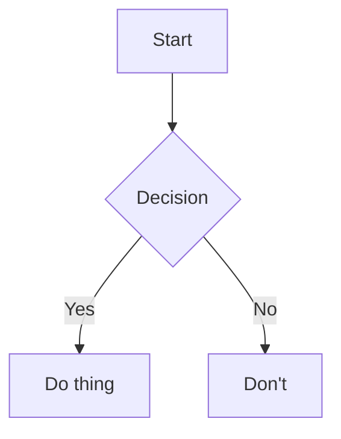

# Handbook-Style Documentation

Use this skill when creating or editing Markdown documentation. It covers
writing style, formatting conventions, and structural guidelines.

## Writing Style

- **British English** throughout (organise, behaviour, colour, centre, etc.)
- Concise and direct. No waffle
- Dry humour and wit are encouraged — dark and self-deprecating preferred.
  But don't force it; a bad joke is worse than no joke
- Use active voice. Passive voice is acceptable when the actor is irrelevant
- Write for someone who will read this at 11pm after a long day. Be clear

## Markdown Formatting

### Alerts / Admonitions

Use GitHub/GitLab-style alerts for callouts:

```markdown
> [!NOTE]
> Supplementary information the reader should know.

> [!TIP]
> Helpful advice for doing things better or more easily.

> [!IMPORTANT]
> Key information the reader needs to succeed.

> [!WARNING]
> Urgent information about potential problems or risks.

> [!CAUTION]
> Negative potential consequences of an action.
```

### Diagrams

Use **Mermaid** for diagrams (flowcharts, sequence diagrams, git graphs):

````markdown

````

Prefer `theme: 'dark'` or `theme: 'forest'` for mermaid init configs.

### Collapsible Sections

Use `<details>` for supplementary content that would clutter the main flow:

```markdown
<details>
<summary><i>Optional: nerdy details</i></summary>

Content here. Markdown **works** inside.

</details>
```

### Code Blocks

- Always specify the language for syntax highlighting
- Use `console` for terminal output, `bash`/`sh` for shell commands
- Add comments in code blocks to explain non-obvious steps
- For config files, use the appropriate language (`toml`, `yaml`, `ini`,
  `json`, `dockerfile`, `gitattributes`, etc.)

### Tables

- Use tables for comparisons and structured data
- Left-align text columns, centre status/boolean columns
- Keep tables readable in raw Markdown (align pipes)

### Line Length and Wrapping

- Prefer one sentence per line in source Markdown (easier diffs)
- Don't hard-wrap prose at 80 characters — let the renderer handle it
- Break long bullet points across lines with proper indentation

## Document Structure

### README Files

Every README should include:

1. **Summary** — what it is and who it's for
2. **Installation** — how to set it up
3. **Usage** — how to use it, with examples

### Larger Documentation

Follow the **Diataxis** model:

- **Tutorials** — learning-oriented, step-by-step
- **How-to guides** — task-oriented, practical
- **Reference** — information-oriented, precise
- **Explanation** — understanding-oriented, conceptual

### Architecture Documentation

For system architecture, consider:

- **C4 model** — context, containers, components, code
- **arc42** — comprehensive structure for content and communication

## Linting and Formatting

- Format Markdown with `prettier`
- Lint with `markdownlint-cli2` (config in `.markdownlint.yaml`)
- Run both via `scripts/format_check.sh` (locally and in CI)

## Things to Avoid

- Unnecessary emojis (unless the user explicitly asks)
- Overly formal or academic tone
- Walls of text without structure
- Documentation that restates the obvious from code
- Stale documentation that contradicts the actual behaviour
